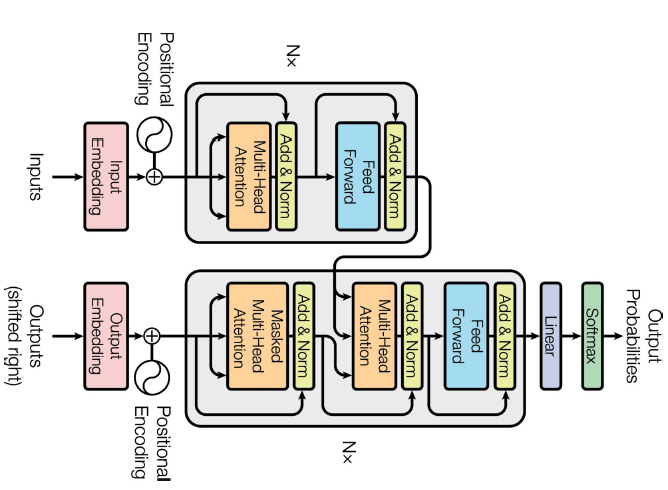
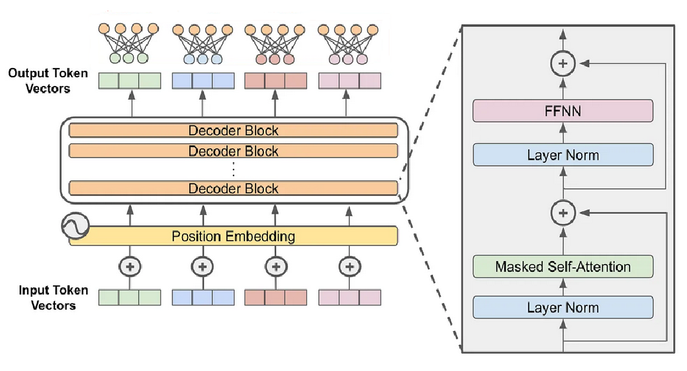

# Transformers Overview


## The Most Famous Image



## GPT-like models



## Decoder Transformer Parts

- The decoder starts with an **embedding layer** that converts the input tokens into dense vectors. A single example has shape $(n, d)$, where $n$ is the number of tokens and $d$ is the dimension of the token embeddings.
- A **positional embedding** is added to the token embeddings to provide information about the position of each token in the sequence.
- Next the sequence is passed through a stack of **decoder blocks**. The shape remains $(n, d)$.
- Finally, each of the $n$ tokens is passed through a linear layer to produce output logits. The output shape is $(n, \text{vocab size})$. 

## A Decoder Block

A decoder block consists of the following components:

- **Masked (Multi-Head) Self Attention**: see later.
- A simple **feed forward neural network** (FFNN) with two linear layers and a activation function in between.
  - The FFNN is applied to each token independently.
- We see **skip connections** (or **residual connections**) that allow gradients to flow through the network more easily.
- **Layer normalization** is applied to the embeddings. This also helps stabilize the training process.


# The Attention Mechanism

## The Attention Mechanism

- The attention mechanism implemented in the transformer architecture is **scaled dot-product attention**.
- The attention mechanism allows the transformer to transfer information between different parts of the input sequence.


## Scaled Dot-Product Attention

Suppose we have three sequences of vectors:

- $\mathbf{Q}\in \mathbb{R}^{n_q\times \textcolor{blue}{d_k}}$, is the query matrix. It contains one row per query. Each query has dimension $\textcolor{blue}{d_k}$.
- $\mathbf{K}\in \mathbb{R}^{\textcolor{red}{n_k}\times \textcolor{blue}{d_k}}$, is the key matrix. It contains one row per key. Each key has dimension $\textcolor{blue}{d_k}$.
- $\mathbf{V}\in \mathbb{R}^{\textcolor{red}{n_k}\times d_v}$, is the value matrix. It contains one row per value. Each value has dimension $d_v$.

## Scaled Dot-Product Attention

Step 1: Compare each query with each key using the dot product.
```
for i in range(n_q):
    for j in range(n_k):
        score[i,j] = Q[i,:] @ K[j,:]
```

Step 2: Scale the scores by dividing by $\sqrt{d_k}$.
```
score = score / sqrt(d_k)
```

## Scaled Dot-Product Attention

Step 3: Apply the softmax function to each row of the score matrix in order to obtain the **attention weights**.
```
for i in range(n_q):
    attention_weights[i,:] = softmax(score[i,:])
```
In row $i$, the attention weight in column $j$ indicates how much the $i$-th query pays attention to the $j$-th key.

## Scaled Dot-Product Attention

Step 4: Compute *linear combinations* of the rows of the value matrix $\mathbf{V}$ using the attention weights.
```
result = zeros((n_q, d_v))
for i in range(n_q):
    for j in range(n_k):
        # Note: scalar multiplication
        result[i,:] += attention_weights[i,j] * V[j,:] 
```


## Scaled Dot-Product Attention


The formula for scaled dot-product attention can be written using matrix multiplication as follows:
$$
\text{Attention}(\mathbf{Q}, \mathbf{K}, \mathbf{V}) = \text{softmax}\left(\frac{\mathbf{Q}\mathbf{K}^T}{\sqrt{d_k}}\right)\mathbf{V}
$$

- $\mathbf{Q}\in \mathbb{R}^{n_q\times d_k}$, is the query matrix. 
- $\mathbf{K}\in \mathbb{R}^{n_k\times d_k}$, is the key matrix. 
- $\mathbf{V}\in \mathbb{R}^{n_k\times d_v}$, is the value matrix. 


## Masked Attention

- With attention as presented, each token can attend to *all* tokens in the input sequence.
- For an **autoregressive model**, tokens should only attend to current and previous tokens, not future tokens.
- Solution is to mask the `score` matrix before applying the softmax function.

## Masked Attention (Example)


$$
\scriptsize
\begin{bmatrix}
s_{11} & s_{12} & s_{13} & s_{14} \\
s_{21} & s_{22} & s_{23} & s_{24} \\
s_{31} & s_{32} & s_{33} & s_{34} \\
s_{41} & s_{42} & s_{43} & s_{44} \\
\end{bmatrix}
\text{is masked to}
\begin{bmatrix}
s_{11} & -\infty &  -\infty &  -\infty \\
s_{21} & s_{22} &  -\infty &  -\infty \\
s_{31} & s_{32} & s_{33} & -\infty \\
s_{41} & s_{42} & s_{43} & s_{44} \\
\end{bmatrix}
$$
After applying the softmax function on each row, we will get
$$
\scriptsize
\begin{bmatrix}
a_{11} & 0 &  0 &  0 \\
a_{21} & a_{22} &  0 &  0 \\
a_{31} & a_{32} & a_{33} & 0 \\
a_{41} & a_{42} & a_{43} & a_{44} \\
\end{bmatrix}
\quad \text{where each row sums to 1}
$$

## Introducing Learnable Parameters

- As presented, the attention mechanism does not have any learnable parameters.
- Suppose we have a sequence of token embeddings $\mathbf{S}\in\mathbb{R}^{n\times d}$
  -  $n$ is the number of tokens; $d$ is the dimension of the token embeddings.
-  We introduce three matrices with learnable parameters:
   - $\mathbf{W_Q}\in\mathbb{R}^{d\times d_k}$, the query projection matrix.
   - $\mathbf{W_K}\in\mathbb{R}^{d\times d_k}$, the key projection matrix.
   - $\mathbf{W_V}\in\mathbb{R}^{d\times d_v}$, the value projection matrix.

## Using Learnable Parameters

- Given the input sequence $\mathbf{S}$, we compute the query, key and value matrices as follows:
$$
\small
\mathbf{Q} = \mathbf{S}\mathbf{W_Q}\in\mathbb{R}^{n\times d_k}, \quad 
\mathbf{K} = \mathbf{S}\mathbf{W_K}\in\mathbb{R}^{n\times d_k}, \quad 
\mathbf{V} = \mathbf{S}\mathbf{W_V}\in\mathbb{R}^{n\times d_v}
$$
- The scaled dot-product attention is then computed on these $\mathbf{Q}$, $\mathbf{K}$, $\mathbf{V}$ matrices.

## Multi-Head Attention

- With **multi-head** attention, we introduce multiple sets ($h$) of learnable parameters:
    - $\mathbf{W}_{\mathbf{Q}}^{(i)}\in\mathbb{R}^{d\times d_k}$, the $i$-th query projection matrix.
    - $\mathbf{W}_{\mathbf{K}}^{(i)}\in\mathbb{R}^{d\times d_k}$, the $i$-th key projection matrix.
    - $\mathbf{W}_{\mathbf{V}}^{(i)}\in\mathbb{R}^{d\times d_v}$, the $i$-th value projection matrix.
    - $\mathbf{W}_{\mathbf{O}}^{(i)}\in\mathbb{R}^{d_v\times d}$, the $i$-th output projection matrix. (New!)
- Note: the output projection matrix is not used in the attention mechanism itself, but is used to project the output of the attention mechanism back to the original dimension $d$.
  
## Multi-Head Attention 

- The multi-head attention mechanism is computed as follows:
```
result = zeros((n_q, d))
for i in 1..h:
    Q = S @ W_Q[i]                # n x d_k
    K = S @ W_K[i]                # n x d_k
    V = S @ W_V[i]                # n x d_v
    H = Attention(Q, K, V)        # n x d_v
    result = result + H @ W_O[i]  # n x d
```
Thus, each "head" computes its own result. This result is projected back to the original dimension $d$. All these projections are summed.

## Single Output Projection Matrix

- The $h$ output projection matrices can be combined into a single output projection matrix $\mathbf{W_O}\in\mathbb{R}^{h\cdot d_v\times d}$:
$$
\mathbf{W}_{\mathbf{O}}^T = \begin{bmatrix} \mathbf{W}_{\mathbf{O}}^{(1)} & \mathbf{W}_{\mathbf{O}}^{(2)} & \cdots & \mathbf{W}_{\mathbf{O}}^{(h)} \end{bmatrix}
$$
- The multi-head attention mechanism can then be computed as follows using matrix multiplication:
$$
\mathrm{Concat}(\mathrm{head}_1, \mathrm{head}_2, \ldots, \mathrm{head}_h) \mathbf{W_O},
$$
where
$$
\mathrm{head}_i = \mathrm{Attention}(\mathbf{S}\mathbf{W}_\mathbf{Q}^{(i)}, \mathbf{S}\mathbf{W}_\mathbf{K}^{(i)}, \mathbf{S}\mathbf{W}_\mathbf{V}^{(i)})
$$

# Exercise: Implementing Multi-Head Attention

## Implement `SingleHeadAttention`

See notebook `multi_head_attention_exercises.ipynb`.


## Implement `SimpleMultiHeadAttention`

See notebook `multi_head_attention_exercises.ipynb`.

# Sources

## Sources


- Figure 1: "Attention is All You Need" by Vaswani et al. (2017)
- Figure 2: Adapted from https://cameronrwolfe.substack.com/p/decoder-only-transformers-the-workhorse